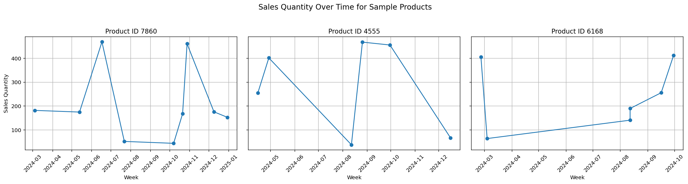
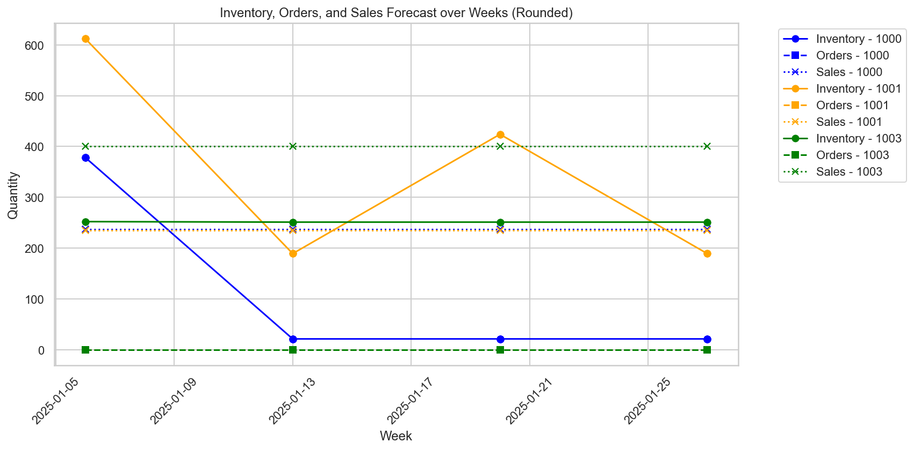

# Inventory-Optimization-for-Retail

Forecast and optimize product inventory using average demand estimation and constrained cost-minimization modelling with Gurobi, incorporating real-world supply chain constraints.

## Table Of Contents
- [Description](#description)
  - [About the Project](#about-the-project)
  - [Why This Project](#why-this-project)
- [Data](#data)
  - [Dataset](#dataset)
- [Methodology](#methodology)
  - [Forecast Model](#forecast-model)
  - [Optimization Model](#optimization-model)
- [Results](#results)
- [Conclusion](#conclusion)
  - [Potential Imporvements](#potential-improvements)

---

## Description
### About the Project

The data for this project is taken from [Inventory Optimization for Retail](https://www.kaggle.com/datasets/suvroo/inventory-optimization-for-retail/data), which has three datasets containing information on sales quantity, price, stock levels etc. with 10,000 rows each. You can view the datasets [here](Data). 

### Why This Project

This project involves **Machine Learning** and **Operations Research** by forecasting the quantity of each product sold over the next four weeks and optimizing the quantity of product to be ordered each week while minimizing the cost of storing and the price of the returned products. This is done using the Python libraries **pandas**, **Matplotlib**, **numpy**, **scikit-learn**, **xgboost** and **gurobipy**. 

## Data
### Dataset

The `demand_forecasting.csv` dataset can be viewed [here](Data/demand_forecasting.csv). It contains 10,000 rows with columns such as `Product ID`, `Date`, `Sales Quantity`, `Seasonality Factors`. Similarly, the other data sets [inventory_monitoring.csv](Data/inventory_monitoring.csv) and [pricing_optimization.csv](Data/pricing_optimization.csv) also contain 10,000 rows providing information such as `Stockout Frequency`, `Reorder Point`, `Return Rate` and `Storage cost`.

To have a better granularity of the data for forecasting and optimizing, the `Date` column was grouped into weeks using the start date of each week. The columns `Seasonality Factors` and `External Factors` contained the value `'None'`, which was interpreted as an empty cell when importing. This was corrected by explicitly filling in missing entries with the string `'None'`.

## Methodology

### Forecast Model

In order to gain a better understanding of the data, the sales quantity of 3 example products was plotted over time. 

Since there was no clear temporal pattern, a Machine Learning-based approach was explored for forecasting.

We aim to perform an XGBoost regression with an 80:20 train-test split in the data. In order to use the string values in the dataset, the following encoding strategies were used:
- `Promotions`: binary mapping using a dictionary.
- `Demand Trend`: ordinal encoding using a dictionary (`Increasing` → 1, `Stable` → 0, `Decreasing` → -1).
- `Seasonality Factors`, `External Factors`, and `Customer Segments`: one-hot encoding.

The XGBoost regression model gave the following error scores:
- **Root Mean Squared Error** : 141.46
- **R² Score** : -0.0151

The R² Score being almost 0 shows that XGBoost is performing worse than a simple average. Hence, the final forecasting model was based on average weekly sales for each product.

### Optimization Model

In order to have a realistic linear optimization model, the following columns were used: `Sales Forecast`, `Price`, `Storage Cost`, `Stock Levels`, `Warehouse Capacity`, `Reorder Point`, `Return Rate (%)`, `Stockout Frequency`, `Supplier Lead Time (days)` and `Order Fulfillment Time (days)`.

The return rate was converted from a percentage into a decimal for easier integration into cost calculations. All relevant columns were converted into dictionaries with `Product ID` as the key. The sales forecast was converted into a dictionary with `(Product ID, Week)` as the key, which also defined the product-week combinations used in the model.

To determine the true reorder point, the values from the column `Reorder Point` were adjusted using the `Stockout Frequency`. A tunable parameter `alpha` was introduced, which determines how much the `Stockout Frequency` affects the reorder point: `Adjusted reorder point = Reorder Point* (1 + alpha * Stockout Frequency)`. The final model used `alpha = 0.05`.

To model delivery delays, it was assumed that the order fulfillment delay and the supplier lead delay occur sequentially. The effective delay was calculated as the sum of the values `Supplier Lead Time (days)` and `Order Fulfillment Time (days)`, which was then rounded up and converted into weeks.

These results were used as inputs to define decision variables for weekly order quantities and resulting inventory levels. Constraints were added to capture inventory balance, warehouse capacity, and reorder requirements. The objective function minimized the combined costs of storage and product returns using the Gurobi optimizer.

## Results

The raw results from the optimization model can be seen [here](Results/Continuous_results.csv). Since the order quantities and inventory levels are integers in practice, the results were **rounded up** and stored [here](Results/Rounded_results.csv). The inventory levels, order quantities and forecasted sales were plotted for 3 example products.

## Conclusion

This project demonstrates an approach to inventory optimization by combining demand forecasting and cost-minimization modeling. Although a machine learning-based regression using XGBoost was initially explored, the resulting model performance was poor (R² ≈ 0), indicating no meaningful predictive pattern in the data. As a result, a simpler average weekly sales was adopted for forecasting.
The overall modeling pipeline reflects several key elements
The optimization model was formulated as a linear program using Gurobi, with constraints for warehouse capacity, reorder thresholds, and delivery delays. The objective was to minimize total costs arising from inventory storage and returned goods. The model provided weekly order quantities and expected inventory levels for each product over a 4-week forecast horizon. The overall modeling pipeline reflects key elements of real-world supply chain management, including handling stockouts, lead times, and variable product behavior.

### Potential Improvements:
- Integrate additional external variables such as price elasticity, customer reviews and competitor prices to improve forecasting accuracy.
- Add constraints related to supplier minimum order quantities, shipping frequency, or budget limits to make the model more comprehensive.

